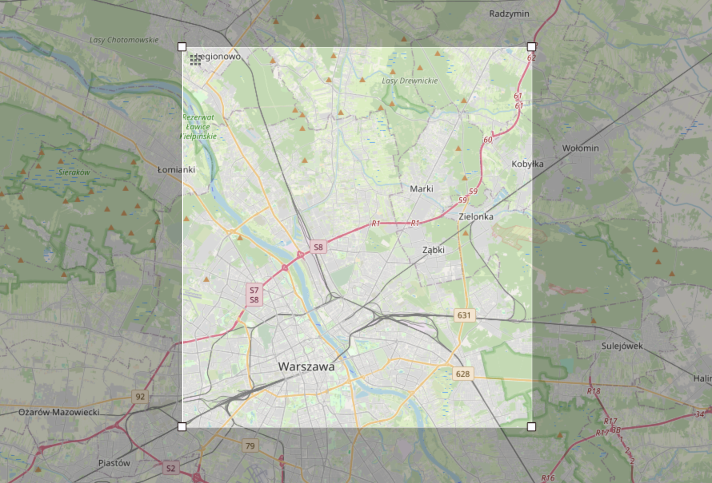

# Wykorzystane Dane
Do projektu wykorzystano dane z: `http://download.geofabrik.de/europe/poland/mazowieckie-latest.osm.pbf`

Ze względu na wydajność kontenerów Docker zdecydowano się na zmniejszenie danych, do danych obejmujących niektóre tereny Warszawy.

Pobrane dane zostały zmniejszone za pomoca narzędzia **osmosis**. 

Wykorzystane polecenie:
```bash
osmosis --read-pbf mazowieckie-latest.osm.pbf \
        --bounding-box top=52.4 left=20.9 bottom=52.2 right=21.2 \
        --write-pbf warszawa.osm.pbf
```



## Sposób załadowania danych do postGIS
Do załadowania danych wykorzystano narzędzie **osm2pgsql**. 

Pobrane dane załadowano przy użyciu komendy:
```bash
osm2pgsql -d gis_db --create --slim --hstore --style /usr/share/osm2pgsql/default.style /data/warszawa.osm.pbf
```
Flagi:
* slim -- użyte ze względu na ograniczone środowisko kontenera Docker
* hstore -- potrzebne ze względu na użycie **osm2pgsql**, by dane zostały poprawnie zaimportowane

